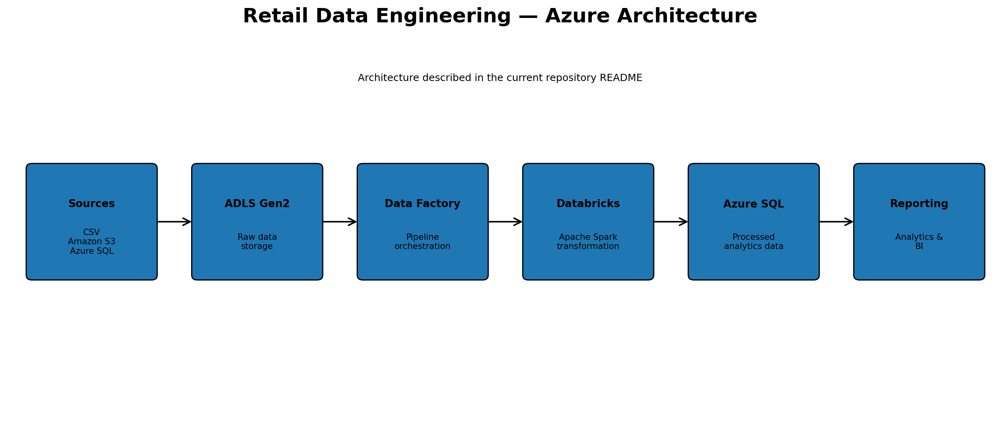
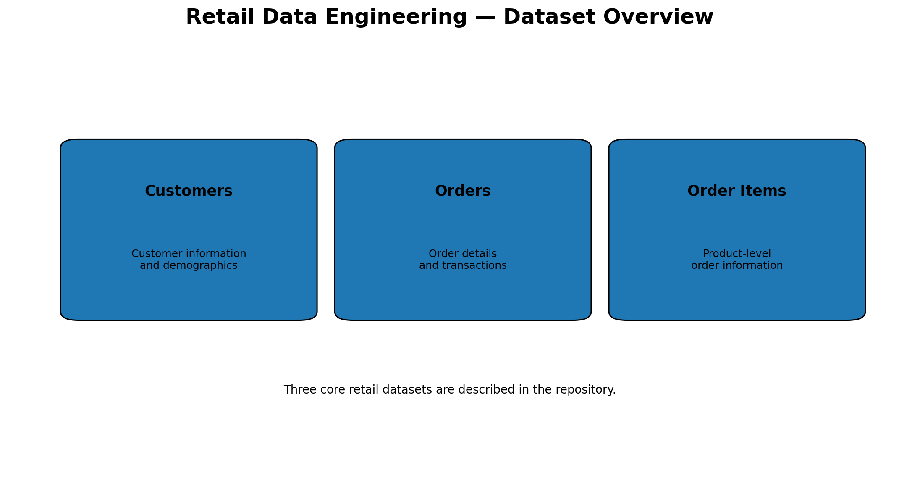
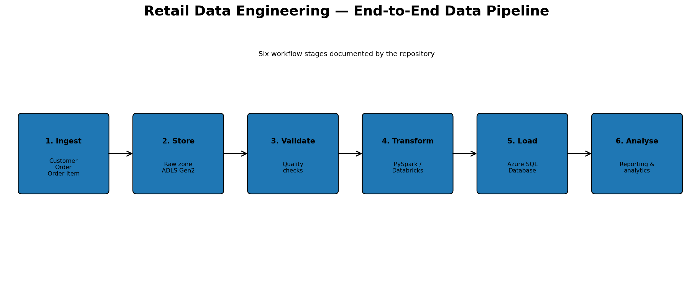
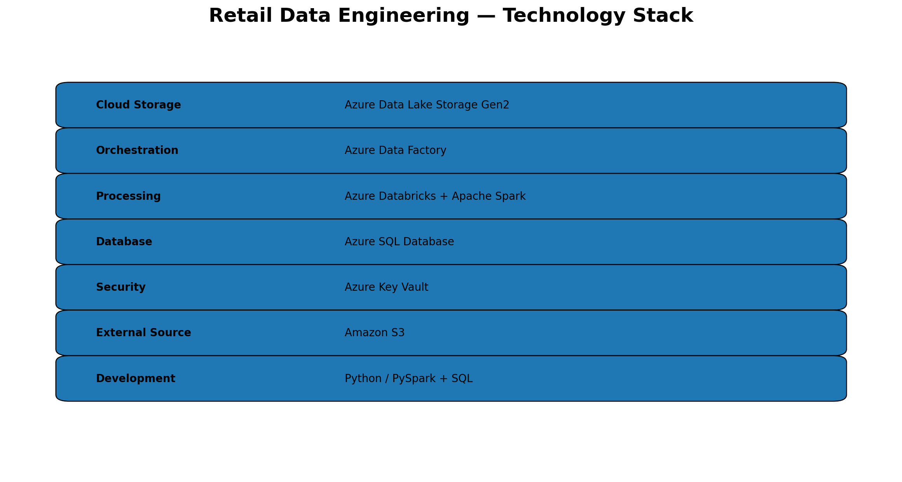
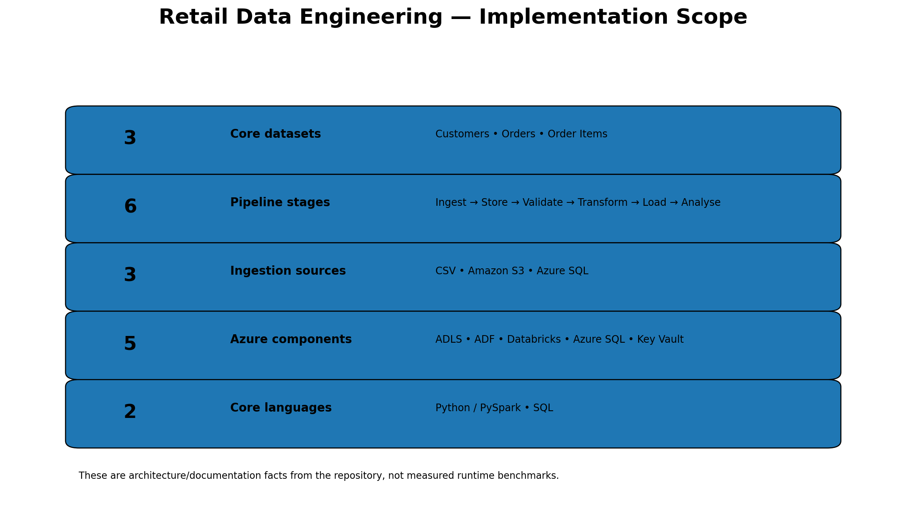

# Retail Data Engineering Project Using Azure

An end-to-end **cloud data engineering project** that builds a retail analytics pipeline using Microsoft Azure. The project integrates customer, order and order-item data from multiple sources, performs validation and transformation using **Apache Spark / PySpark**, and prepares processed data for analytics in **Azure SQL Database**.

The project demonstrates the complete data-engineering lifecycle:

```text
Multi-Source Data
      ↓
Azure Data Lake Storage Gen2
      ↓
Azure Data Factory
      ↓
Azure Databricks / Apache Spark
      ↓
Data Validation & Transformation
      ↓
Azure SQL Database
      ↓
Retail Analytics & Reporting
```

The repository currently documents this architecture, including Amazon S3, Azure SQL and CSV ingestion, ADLS Gen2 storage, Databricks/Spark processing, Data Factory orchestration and Key Vault-based credential management. citeturn0view0

---

# 1. Project Objective

Retail organisations generate data across customers, orders and individual order items. A data engineering pipeline is required to bring these datasets together, validate them, transform them into an analytics-ready structure and make them available for reporting.

This project focuses on:

- Multi-source data ingestion
- Cloud data storage
- ETL/ELT pipeline design
- Data validation and cleansing
- Distributed data processing
- Secure credential management
- Structured analytical storage
- Retail analytics readiness

The repository specifically describes an automated Azure-based workflow for ingesting, transforming and loading retail data. citeturn0view0

---

# 2. Architecture



The architecture connects:

**Amazon S3 / CSV / Azure SQL → ADLS Gen2 → Azure Data Factory → Azure Databricks / Spark → Azure SQL Database → Analytics**

### Architecture components

| Component | Role |
|---|---|
| Amazon S3 | External source |
| CSV files | Source data |
| Azure SQL Database | Source and analytical database layer |
| ADLS Gen2 | Cloud data lake / raw storage |
| Azure Data Factory | Pipeline orchestration |
| Azure Databricks | Distributed data processing |
| Apache Spark | Transformation engine |
| Azure Key Vault | Credential / secret management |
| Azure SQL Database | Processed analytical storage |

These components are explicitly listed in the repository's current architecture and technology-stack documentation. citeturn0view0

---

# 3. Data Sources

The project integrates data from multiple source types:

```text
Amazon S3
CSV Files
Azure SQL Database
```

This multi-source approach demonstrates a practical data-integration scenario rather than relying on a single flat file.

---

# 4. Core Datasets

The project processes three core retail datasets:



### Customers

Contains customer-level information and demographic attributes.

### Orders

Contains order-level transaction records.

### Order Items

Contains product-level information associated with individual orders.

The three datasets are explicitly documented in the repository README. citeturn0view0

---

# 5. End-to-End Data Pipeline



The pipeline follows six major stages.

## Stage 1 — Ingestion

Retail datasets are collected from multiple sources.

```text
Amazon S3
CSV
Azure SQL
```

## Stage 2 — Raw Storage

Incoming data is stored in **Azure Data Lake Storage Gen2**.

This creates a central cloud storage layer before transformation.

## Stage 3 — Validation

The pipeline applies data-quality and validation checks before analytical processing.

Examples include:

- Missing-value checks
- Schema validation
- Duplicate detection
- Data-type validation
- Business-rule checks

## Stage 4 — Transformation

Azure Databricks and Apache Spark are used to transform the raw datasets.

Typical transformation activities include:

- Cleaning
- Joining datasets
- Standardising fields
- Applying business rules
- Creating derived analytical fields

## Stage 5 — Loading

The processed datasets are loaded into **Azure SQL Database** for downstream analytical use.

## Stage 6 — Analytics

The transformed data becomes available for retail reporting and analytical workloads.

The six-stage workflow is consistent with the pipeline workflow described in the repository README. citeturn0view0

---

# 6. Technology Stack



| Technology | Purpose |
|---|---|
| **Python / PySpark** | Data transformation and processing |
| **SQL** | Querying and analytical transformations |
| **Apache Spark** | Distributed processing |
| **Azure Data Lake Storage Gen2** | Cloud data storage |
| **Azure Databricks** | Spark-based processing environment |
| **Azure Data Factory** | Pipeline orchestration |
| **Azure SQL Database** | Structured analytical storage |
| **Azure Key Vault** | Secure secret management |
| **Amazon S3** | External data source |

These technologies are listed in the current repository README. citeturn0view0

---

# 7. Data Engineering Concepts Demonstrated

## ETL Pipeline

The project demonstrates:

**Extract → Transform → Load**

with multiple sources feeding a cloud-based analytical workflow.

## Cloud Data Integration

The architecture combines external and cloud-native data sources.

## Distributed Processing

Apache Spark enables transformation of larger datasets through distributed processing.

## Data Quality

Validation and cleansing are positioned before the final analytical load.

## Secure Data Engineering

Azure Key Vault is included for credential and secret management rather than placing credentials directly in processing code.

## Analytics Readiness

The processed output is stored in Azure SQL Database so downstream reporting can work with structured, transformed data.

These capabilities align with the repository's documented features and key concepts. citeturn0view0

---

# 8. Data Quality Framework

A production-oriented version of the pipeline should validate data at several stages.

### Schema validation

Check:

- Column names
- Data types
- Required fields
- Unexpected columns

### Completeness

Check:

- Missing customer IDs
- Missing order IDs
- Missing product information
- Null transaction values

### Uniqueness

Check:

- Duplicate customer records
- Duplicate order IDs
- Duplicate order-item combinations

### Referential integrity

Validate relationships such as:

```text
Customer
   ↓
Orders
   ↓
Order Items
```

### Business rules

Examples:

- Quantity should be positive
- Transaction values should be valid
- Order dates should be valid
- Foreign keys should map to existing records

---

# 9. Data Model

The three core datasets naturally form a relational retail structure:

```text
             ┌──────────────┐
             │  Customers   │
             └──────┬───────┘
                    │
                    │ customer_id
                    ↓
             ┌──────────────┐
             │    Orders    │
             └──────┬───────┘
                    │
                    │ order_id
                    ↓
             ┌──────────────┐
             │ Order Items  │
             └──────────────┘
```

This structure supports analysis at multiple levels:

- Customer
- Order
- Product / order item

---

# 10. Analytics Use Cases

Once transformed and loaded into Azure SQL Database, the data can support:

### Sales analysis

- Revenue by period
- Order volume
- Average order value
- Product performance

### Customer analysis

- Customer purchase frequency
- Customer value
- Repeat purchasing
- Customer segmentation

### Product analysis

- Product-level sales
- Quantity sold
- Product contribution to revenue

### Operational analysis

- Order trends
- Transaction volumes
- Data-quality monitoring

---

# 11. Implementation Scope



The documented project scope includes:

| Area | Scope |
|---|---|
| Core datasets | **3** |
| Source types | **3** |
| Pipeline stages | **6** |
| Major Azure components | **5+** |
| Processing technologies | **PySpark / Spark / SQL** |

These are **architecture and implementation-scope facts**, not performance benchmarks.

The current repository specifically documents three datasets, multiple ingestion sources, Azure orchestration, Databricks/Spark processing, Azure SQL storage and Key Vault. citeturn0view0

---

# 12. Security

Azure Key Vault is included as part of the architecture for secure credential management.

A production implementation should follow:

```text
Application / Pipeline
        ↓
Azure Key Vault
        ↓
Secret / Credential
        ↓
Data Source
```

Secrets should never be committed to GitHub.

---

# 13. Scalability Considerations

The architecture is designed around cloud-native components:

- **ADLS Gen2** for scalable storage
- **Databricks / Spark** for distributed processing
- **Data Factory** for orchestration
- **Azure SQL** for structured analytical workloads

This makes the architecture suitable for extending the pipeline as data volume and processing requirements grow.

> Scalability here refers to the architectural design. No specific throughput or runtime benchmark is claimed unless measured separately.

---

# 14. Data Pipeline Reliability

Important reliability considerations include:

- Source availability checks
- Schema validation
- Pipeline failure handling
- Retry policies
- Data-quality validation
- Duplicate detection
- Logging
- Secret management
- Load validation

A production deployment should additionally record pipeline-run metadata such as:

```text
Run ID
Start Time
End Time
Rows Ingested
Rows Rejected
Rows Loaded
Status
Error Message
```

---

# 15. Reproducibility

The project separates major areas of the engineering workflow:

```text
notebooks/
datasets/
sql/
images/
architecture/
README.md
```

This structure makes the project easier to inspect and extend.

For stronger reproducibility, record:

- Python version
- Spark version
- Databricks runtime
- SQL version
- Dataset version
- Pipeline configuration
- Transformation logic
- Environment variables / secret configuration

---

# 16. Project Workflow Summary


The complete project can be summarised as:

```text
1. Collect
      ↓
2. Store
      ↓
3. Validate
      ↓
4. Transform
      ↓
5. Load
      ↓
6. Analyse
```

The repository's documented workflow follows this same sequence: ingest datasets, store raw data in ADLS Gen2, validate and transform using Databricks, apply business rules and quality checks, load into Azure SQL and enable reporting. citeturn0view0

---

# 17. Limitations

The current repository documents the architecture and pipeline design, but the public repository page does not provide measured evidence for:

- Pipeline execution time
- Throughput
- Rows processed per second
- Azure cost
- Data-quality percentages
- ADF run-history metrics
- Databricks job metrics
- Azure SQL query-performance benchmarks

These should not be invented.

For a Master's portfolio, measured execution evidence can be added later if available.

---

# 18. Future Improvements

### Data engineering

- Incremental ingestion
- CDC implementation
- Medallion architecture
- Delta Lake tables
- Automated schema evolution

### Data quality

- Great Expectations / automated validation
- Data-quality scorecards
- Rejected-record quarantine
- Automated data-quality alerts

### Orchestration

- Parameterised ADF pipelines
- Retry and failure workflows
- Pipeline monitoring
- Automated notifications

### Analytics

- Dimensional/star schema
- Power BI dashboard
- Sales forecasting
- Customer segmentation
- Product-performance analytics

### DevOps

- CI/CD for Databricks notebooks
- Infrastructure as Code
- Automated testing
- Environment promotion

---

# 19. Academic Positioning

This project demonstrates an end-to-end **cloud data engineering workflow** rather than only a data-analysis notebook.

It combines:

**Data Integration + Cloud Storage + ETL + Distributed Processing + Data Quality + Security + Analytical Storage**

This makes it relevant to Master's applications in:

- Data Engineering
- Data Science
- Business Analytics
- Computer Science
- Information Systems
- Cloud Computing
- Digital Transformation

The strongest academic aspect is the connection between **cloud architecture and data-processing logic**: data moves from multiple sources through an orchestrated pipeline, is transformed using distributed Spark processing, validated, and prepared for analytical consumption.

---

# 20. Repository Structure

```text
Retail_Data_Engineering_Project/
│
├── Datasets/
├── architecture/
├── dashboard/
├── data_quality/
├── docs/
├── images/
├── notebooks/
├── performance/
├── sql/
├── tests/
├── README.md
└── Sales_Project.ipynb
```

The live repository currently exposes the original datasets, notebook and README; the README itself describes the broader target structure including notebooks, datasets, SQL, images and architecture. citeturn0view0

---

# Author

**Varshita Jogur**

GitHub: https://github.com/varshitajogur
